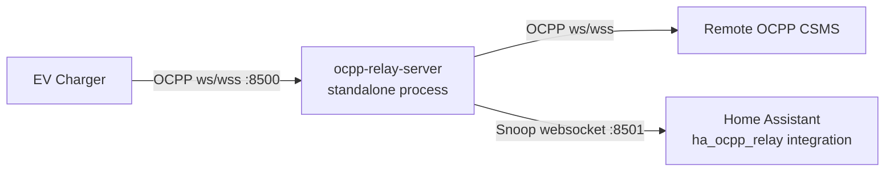

# ha-ocpp-relay

`ha-ocpp-relay` is derived from `ocpp2mqtt` and keeps the same OCPP relay + snoop design, with Home Assistant-native consumption replacing MQTT publishing.

## What changed

1. This repository is structured as a Home Assistant HACS custom integration.
2. The MQTT snoop client is replaced by a Home Assistant-native integration that creates sensor entities directly inside Home Assistant.

## Repository layout

- `custom_components/ha_ocpp_relay/`: HACS custom integration.
- `relay_server/`: Standalone OCPP relay server and snoop websocket service.

## Architecture

The relay runs as a standalone process between the charge point and CSMS.
Home Assistant (installed via HACS) connects to the relay snoop websocket and
creates native sensor entities directly in Home Assistant.



## Deployment modes

### Single host

- Run the relay and Home Assistant on the same machine or LAN endpoint.
- Configure the integration snoop socket as `ws://localhost:8501/`.

### Separate relay host

This setup is supported. The relay can run on a different machine than Home Assistant.

- Start relay with a reachable snoop bind address, for example:

```bash
python -m relay_server.ocpp_relay_server \
	--cpms wss://<actual-ocpp-server>/ws/webSocket \
	--snoop-host 0.0.0.0 \
	--snoop-port 8501
```

- In the Home Assistant integration, set the snoop socket to the relay host, for example:
	`ws://relay-host-or-ip:8501/`

- Ensure firewall/network rules allow Home Assistant to reach the relay snoop port.
- The snoop websocket has no application-layer authentication; run it on a trusted network,
	or protect it with host firewall, VPN, and/or reverse proxy controls.

## HACS installation

1. Add this repository as a custom repository in HACS (`Integration` type).
2. Install `ha-ocpp-relay`.
3. Restart Home Assistant.
4. Add integration: **Settings -> Devices & Services -> Add Integration -> HA OCPP Relay**.
5. Set the snoop websocket URL (for example `ws://localhost:8501/`).

## Running the relay server

```bash
python -m relay_server.ocpp_relay_server --cpms wss://<actual-ocpp-server>/ws/webSocket
```

## Configuration example

See `configs/configuration_example.yaml`.

## Release versioning

- Python package version comes from git tags via `setuptools-scm`.
- Home Assistant manifest version is synced automatically by GitHub Actions on release publish.
- Use release tags like `v0.2.0` (or `0.2.0`). The workflow strips an optional `v` prefix.
