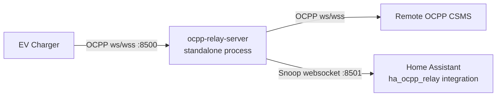

# ha-ocpp-relay

EV chargers are typically controlled by the [Open Charge Point Protocol](https://openchargealliance.org/protocols/open-charge-point-protocol/) \(OCPP\). The protocol includes metering. Extracting metering data from a charger is challenging if you have to implement a full Charge Point Management System \(CPMS\). The relay acts as a full CPMS to an EV charger but implements the service by relaying all requests to a real CPMS. The relay exposes a second service where OCPP traffic can be monitored. No commands are accepted on this snoop port. Multiple clients may connect to the snoop service and each one receives the same OCPP JSON stream.

The relay [ocpp-relay-server](ocpp-relay-server.py) should work with any charge point. Data is forwarded blindly. It is derived from https://github.com/saisasidhar/ocpp-relay.

The provided HACS integration monitors OCPP messages and maps them to Home Assistant sensors. The repository also contains functionally equivalent command-line tools that share the same underlying libraries and implement the relay and MQTT sensor streams. Most users should choose the HACS integration.

## HACS installation

**This integration is not in the official HACS list. You must add it as a custom repository before installation:**

1. In Home Assistant, open HACS → Integrations.
2. Click the three dots (⋮) in the top right and select **Custom repositories**.
3. Add this repository URL: `https://github.com/michael-adler/ha-ocpp-relay` as type **Integration**.
4. After adding, search for **HA OCPP Relay** in HACS and install it.
5. Restart Home Assistant.

**Quick install (after adding as custom repo):**

[](https://my.home-assistant.io/redirect/integration/?domain=ha_ocpp_relay)

1. Click the badge above to open the add integration dialog directly in your Home Assistant instance or, in Home Assistant, go to [Settings → Devices & Services → Add Integration](https://my.home-assistant.io/redirect/integration/?domain=ha_ocpp_relay) and search for **HA OCPP Relay**.
2. Follow the prompts to configure the integration.
3. Configure relay settings in the integration UI:
	- `relay_is_local`: whether Home Assistant should run the relay process.
	- `cpms_url`: remote CSMS URL used by the relay process (required when local relay is enabled).
	   Relays are typically web sockets, e.g. wss://gateway-eneprodus.autel.com/ws/webSocket.
	   The serial numbers of EV chargers connecting through the relay will automatically be
	   appended to the URL.
	- `relay_ocpp_host` and `relay_ocpp_port`: relay bind address/port for charge points.
	- `relay_snoop_host` and `relay_snoop_port`: relay snoop bind address/port.
	- `snoop_socket`: URL used by the HA snoop client.

All settings are editable later from integration options; updates reload the integration and apply new values.

## Repository layout

- `custom_components/ha_ocpp_relay/`: HACS custom integration.
- `relay_server/`: Standalone OCPP relay server and snoop websocket service.

## Architecture

The relay runs as a standalone process between the charge point and CSMS.
Home Assistant (installed via HACS) connects to the relay snoop websocket and
creates native sensor entities directly in Home Assistant.



## Deployment modes

### Single host

- Enable local relay mode in integration options.
- The integration starts and supervises the relay process automatically.
- Default snoop socket is `ws://127.0.0.1:8501/` (container-local relay snoop endpoint).
- If the relay process crashes, it is restarted automatically after 15 seconds.

### Separate relay host

This setup is supported. The relay can run on a different machine than Home Assistant.

- Start relay with a reachable snoop bind address, for example:

```bash
python -m relay_server.ocpp_relay_server \
	--cpms wss://<actual-ocpp-server>/ws/webSocket \
	--snoop-host 0.0.0.0 \
	--snoop-port 8501
```

- In the Home Assistant integration, set the snoop socket to the relay host, for example:
	`ws://relay-host-or-ip:8501/`
- Disable local relay mode in integration options.

- Ensure firewall/network rules allow Home Assistant to reach the relay snoop port.
- The snoop websocket has no application-layer authentication; run it on a trusted network,
	or protect it with host firewall, VPN, and/or reverse proxy controls.

## Running the relay server

If `relay_is_local` is enabled, the integration runs the relay process and this step is not required.

```bash
python -m relay_server.ocpp_relay_server --cpms wss://<actual-ocpp-server>/ws/webSocket
```

## External MQTT helper scripts

The package also includes two external CLI scripts:

- `ocpp-snoop2mqtt`: subscribes to the relay snoop websocket and publishes mapped telemetry to MQTT.
- `ocpp-snoop-recorder`: records the raw snoop websocket JSON stream to a file for later replay or analysis.

`ocpp-snoop2mqtt` is not required when you use the `ha_ocpp_relay` Home Assistant integration, because that integration already consumes the snoop stream directly and creates entities natively. It is included for deployments where both the relay and MQTT client are run outside Home Assistant.

`ocpp-snoop-recorder` can be useful for debugging. It records a log of OCPP transactions that can be replayed later.

Example usage:

```bash
ocpp-snoop2mqtt --snoop-socket ws://127.0.0.1:8501/ --mqtt-broker-host localhost
ocpp-snoop-recorder --snoop-socket ws://127.0.0.1:8501/ --output output.json
```

## Configuration example

See `configs/configuration_example.yaml`.
