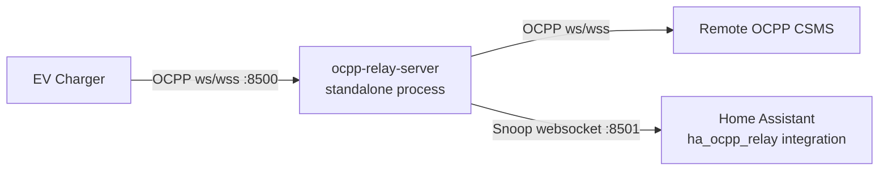

# ha-ocpp-relay

`ha-ocpp-relay` is derived from `ocpp2mqtt` and keeps the same OCPP relay + snoop design, with Home Assistant-native consumption replacing MQTT publishing.

## What changed

1. This repository is structured as a Home Assistant HACS custom integration.
2. The MQTT snoop client is replaced by a Home Assistant-native integration that creates sensor entities directly inside Home Assistant.
3. The relay process can now be managed directly by the Home Assistant integration.

## Repository layout

- `custom_components/ha_ocpp_relay/`: HACS custom integration.
- `relay_server/`: Standalone OCPP relay server and snoop websocket service.

## Architecture

The relay runs as a standalone process between the charge point and CSMS.
Home Assistant (installed via HACS) connects to the relay snoop websocket and
creates native sensor entities directly in Home Assistant.



## Deployment modes

### Single host

- Enable local relay mode in integration options.
- The integration starts and supervises the relay process automatically.
- Default snoop socket is `ws://127.0.0.1:8501/` (container-local relay snoop endpoint).
- If the relay process crashes, it is restarted automatically after 15 seconds.

### Separate relay host

This setup is supported. The relay can run on a different machine than Home Assistant.

- Start relay with a reachable snoop bind address, for example:

```bash
python -m relay_server.ocpp_relay_server \
	--cpms wss://<actual-ocpp-server>/ws/webSocket \
	--snoop-host 0.0.0.0 \
	--snoop-port 8501
```

- In the Home Assistant integration, set the snoop socket to the relay host, for example:
	`ws://relay-host-or-ip:8501/`
- Disable local relay mode in integration options.

- Ensure firewall/network rules allow Home Assistant to reach the relay snoop port.
- The snoop websocket has no application-layer authentication; run it on a trusted network,
	or protect it with host firewall, VPN, and/or reverse proxy controls.

## HACS installation

1. Add this repository as a custom repository in HACS (`Integration` type).
2. Install `ha-ocpp-relay`.
3. Restart Home Assistant.
4. Add integration: **Settings -> Devices & Services -> Add Integration -> HA OCPP Relay**.
5. Configure relay settings in the integration UI:
	- `relay_is_local`: whether Home Assistant should run the relay process.
	- `cpms_url`: remote CSMS URL used by the relay process (required when local relay is enabled).
	- `relay_ocpp_host` and `relay_ocpp_port`: relay bind address/port for charge points.
	- `relay_snoop_host` and `relay_snoop_port`: relay snoop bind address/port.
	- `snoop_socket`: URL used by the HA snoop client.

All settings are editable later from integration options; updates reload the integration and apply new values.

## Running the relay server

If `relay_is_local` is enabled, the integration runs the relay process and this step is not required.

```bash
python -m relay_server.ocpp_relay_server --cpms wss://<actual-ocpp-server>/ws/webSocket
```

## External MQTT helper scripts

The package also includes two external CLI scripts:

- `ocpp-snoop2mqtt`: subscribes to the relay snoop websocket and publishes mapped telemetry to MQTT.
- `ocpp-snoop-recorder`: records the raw snoop websocket JSON stream to a file for later replay or analysis.

`ocpp-snoop2mqtt` is not required when you use the `ha_ocpp_relay` Home Assistant integration, because that integration already consumes the snoop stream directly and creates entities natively. It is included for deployments where both the relay and MQTT client are run outside Home Assistant.

`ocpp-snoop-recorder` can be useful for debugging. It records a log of OCPP transactions that can be replayed later.

Example usage:

```bash
ocpp-snoop2mqtt --snoop-socket ws://127.0.0.1:8501/ --mqtt-broker-host localhost
ocpp-snoop-recorder --snoop-socket ws://127.0.0.1:8501/ --output output.json
```

## Configuration example

See `configs/configuration_example.yaml`.

## Release versioning

- Python package version comes from git tags via `setuptools-scm`.
- Home Assistant manifest version is synced automatically by GitHub Actions on release publish.
- Use release tags like `v0.2.0` (or `0.2.0`). The workflow strips an optional `v` prefix.
