# EV Charger OCPP Relay for Home Assistant

[](https://github.com/michael-adler/ha-ocpp-relay)

EV chargers are typically controlled by the [Open Charge Point Protocol](https://openchargealliance.org/protocols/open-charge-point-protocol/) \(OCPP\). The protocol includes metering. For some users, connecting to a particular remote OCPP server is essential for electrical billing discounts or access control. The code here monitors OCPP traffic to track energy use but acts only as a relay between an EV charger and the remote Charge Point Management System \(CPMS\). The relay exposes a second socket where OCPP traffic can be monitored. Multiple clients may connect to the snoop service and each one receives the same read-only OCPP JSON stream.

Use this project if you want to continue using your vendor's OCPP server while monitoring energy use. If your goal is to run your own local OCPP server and no longer connect to a vendor-provided server, use the [OCPP HACS extension](https://github.com/lbbrhzn/ocpp/) instead.

The relay should work with any charge point. Data is forwarded blindly. It is derived from https://github.com/saisasidhar/ocpp-relay.

The provided HACS integration monitors OCPP messages and maps them to Home Assistant sensors. The repository also contains functionally equivalent command-line tools that share the same underlying libraries and implement the relay and MQTT sensor streams. Most Home Assistant users should choose the HACS integration. The alternate command-line tools can be installed on any host using pip install, without depending on Home Assistant libraries. 

## HACS installation

**This integration is not in the official HACS list. You must add it as a custom repository before installation:**

1. In Home Assistant, open HACS → Integrations.
2. Click the three dots (⋮) in the top right and select **Custom repositories**.
3. Add this repository URL: `https://github.com/michael-adler/ha-ocpp-relay` as type **Integration**.
4. After adding, search for **OCPP Relay** in HACS and download it.
5. Restart Home Assistant.

**Quick install (after adding as custom repo):**

[](https://my.home-assistant.io/redirect/integration/?domain=ha_ocpp_relay)

1. Click the badge above to open the add integration dialog directly in your Home Assistant instance or, in Home Assistant, go to [Settings → Devices & Services → Add Integration](https://my.home-assistant.io/redirect/integration/?domain=ha_ocpp_relay) and search for **HA OCPP Relay**.
2. Follow the prompts to configure the integration.
3. Configure relay settings in the integration UI:
	- `Use local relay`: Whether Home Assistant should run the relay process. Most users should leave this enabled.
	   When enabled, the relay is run automatically in the background.
	- `Relay OCPP host` and `Relay OCPP port`: Relay bind address/port for charge points. When the relay is local the host is the Home Assistant server. This is the port to which your EV charger will connect.
	- `Relay snoop host` and `Relay snoop port`: Relay snoop bind address/port. Typically set to the local interface when the relay is local to Home Assistant. The snoop port contains the data stream of OCPP traffic that will be mapped to sensors. For local relays, change the port only if there is a conflict with some other service.
	- `CPMS URL`: Remote OCPP server to which the relay will connect, required when local relay is enabled.
	   Relays are typically web sockets, e.g. wss://gateway.example.com/ws/webSocket.
       Copy the URL that is currently set in your EV charger. Charger serial numbers are appended automatically.
	   Do not add a serial number here.
	- `Snoop socket`: URL used by the HA snoop client, configurable only when the relay is remote.

All settings are editable later from integration options.

## EV charger setup

After you have set up the OCPP relay integration, update your EV charger so that it connects to Home Assistant. When you set up the OCPP integration, you found the URL of the CPMS set in your charger and copied it to Home Assistant. Now change the URL set in your charger to connect to the OCPP relay port, for example: `ws://homeassistant.local:8500/`. If homeassistant.local isn't resolved by the charger, replace it with a DNS name you have defined or the IP address of your Home Assistant server.

Most chargers will append the ID of the charger automatically. Ensure that the URL that eventually reaches the OCPP relay ends with the ID.

## Repository layout

- `custom_components/ha_ocpp_relay/`: HACS custom integration.
- `relay_server/`: Standalone OCPP relay server and snoop websocket service.

## Architecture

The relay runs as a standalone process between the charge point and CPMS.
Home Assistant (installed via HACS) connects to the relay snoop websocket and
creates native sensor entities directly in Home Assistant. The stand-alone
variant is similar, but connects to an MQTT broker instead of directly to
the Home Assistant sensor API.

Arrows describe the direction in which websockets are opened, toward the listener,
and not the direction in which data flows. OCPP relay traffic is bidirectional and
snoop data flows from the relay toward the snoop client.



The relay supports multiple simultaneous EV charger connections and relays them to
individual, private OCPP server connections. Traffic from all relayed connections
is merged and forwarded to the snoop port. OCPP already tags each message with the
unique ID of each charger. Generated Home Assistant sensor names and MQTT topics
will include the ID.

## Deployment modes

### Single host with local relay (default)

- Enable local relay mode in integration options.
- The integration starts and supervises the relay process automatically.
- Default snoop socket is `ws://127.0.0.1:8501` (container-local relay snoop endpoint).
- If the relay process crashes, it is restarted automatically after 15 seconds.
- Direct your EV charger to the relay port on your Home Assistant instance, e.g. `ws://homeassistant.local:8500`.

### Separate relay host (alternate configuration)

If desired, the relay can run on a different machine than Home Assistant.

- Install the CLI tools on the relay host and start the relay with a reachable snoop bind address, for example:

```bash
ocpp-relay-server \
	--cpms wss://<actual-ocpp-server>/ws/webSocket \
	--snoop-host 0.0.0.0 \
	--snoop-port 8501
```

- Disable local relay mode in integration options.
- In the Home Assistant integration, set the snoop socket to the relay host, for example:
	`ws://relay-host-or-ip:8501/`.
- Ensure firewall/network rules allow Home Assistant to reach the relay snoop port.
- The snoop websocket has no application-layer authentication. Run it on a trusted network,
	or protect it with host firewall, VPN, and/or reverse proxy controls.
- Direct your EV charger to the websocket relay port on the relay host (default 8500).

## External MQTT helper scripts

The package also includes two external CLI scripts. These share some of the library code but are not used when local relay is enabled.

- `ocpp-snoop2mqtt`: subscribes to the relay snoop websocket and publishes mapped telemetry to MQTT.
- `ocpp-snoop-recorder`: records the raw snoop websocket JSON stream to a file for later replay or analysis.

`ocpp-snoop2mqtt` is included for deployments where both the relay and MQTT client are run outside Home Assistant.

`ocpp-snoop-recorder` can be useful for debugging. It records a log of OCPP transactions that can be replayed later.

Example usage:

```bash
ocpp-snoop2mqtt --snoop-socket ws://127.0.0.1:8501/ --mqtt-broker-host localhost
ocpp-snoop-recorder --snoop-socket ws://127.0.0.1:8501/ --output output.json
```

## Configuration example

See `configs/configuration_example.yaml`. This configuration is used only by the command-line tools. HACS users can ignore it.
