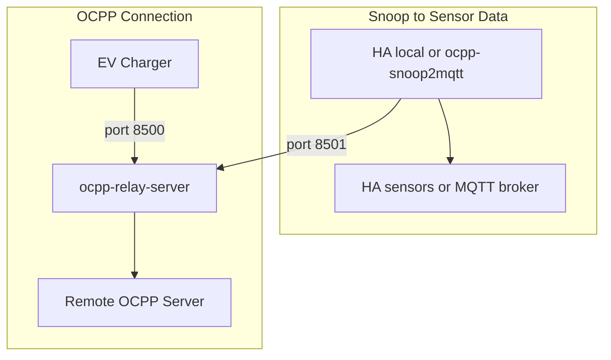

# Image Generation

HACS doesn't render Mermaid embedded in Markdown, so the Mermaid code that used to be in documentation has been moved here to preserve it. The SVG files are rendered from Mermaid source with:

1. Follow instructions to render mermaid as svg at https://mermaid.ink/ to generate an encoded string from the source.
2. Pass the encoded string to https://mermaid.ink/svg/pako:\<string\>.
3. Inspect the web page and copy the SVG portion.
4. Render the SVG to reduce external dependence with https://jakearchibald.github.io/svgomg/.

## architecture.svg

